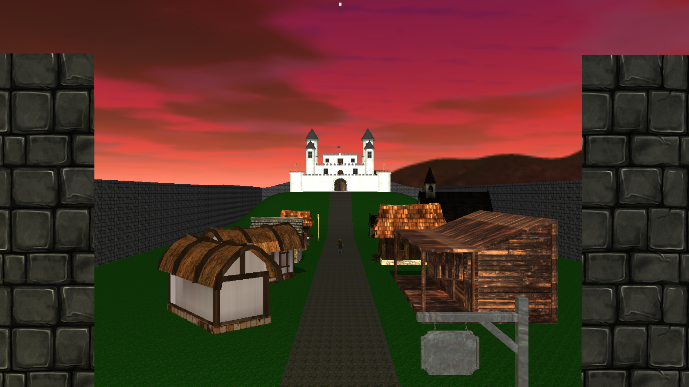
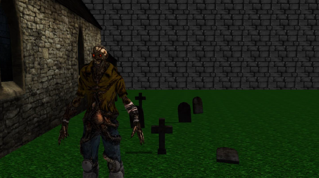

# GPS-Project
This is my project for the "Graphical Processing Systems" laboratory.

**Subject** 
The subject of the project consists in the photorealistic presentation of 3D using the **OpenGL** library. Through the graphical interface, the user should be able to control and visualize the scene using the keyboard and mouse as well as opt for an automated view of the scene. 

  

**Scenario** 
The scene consists of numerous houses placed along the main road, a cathedral with a cemetery from which zombies emerge, stone walls that form the perimeter of the scene and a castle that overlooks the village. Additionally, the whole scene is enclosed in a skybox that provides the background, making the scene look nicer and bigger than it really is.  

  

**Notes** 
- Additional information can be read in the project documentation present in the 'Doc" folder.
- I could not upload the whole project as it is too large.
- The sources, headers and shaders can be seen in the 'App' folder.

